# Stargazer NGFW — Architecture Flows

Complete system flows traced from codebase. All diagrams in Mermaid format.

---

## 1. Boot Flow

```mermaid
flowchart TD
    KERNEL[Kernel boot] --> INIT["/sbin/init (PID 1)<br/>src/userspace/init"]

    subgraph INIT_PHASE["Init Phase"]
        INIT --> MOUNT["Mount filesystems<br/>proc, sysfs, devtmpfs, tmpfs"]
        MOUNT --> STORAGE{"Detect persistent<br/>storage?"}
        STORAGE -->|"eMMC p5 or<br/>QEMU vdb"| FSCK["e2fsck / format<br/>if blank"]
        STORAGE -->|"Not found"| TMPFS_FALLBACK["tmpfs fallback<br/>/etc/stargazer"]
        FSCK --> MOUNT_DATA["Mount /etc/stargazer<br/>(config + DB)"]
        TMPFS_FALLBACK --> MOUNT_DATA
        MOUNT_DATA --> LOGS_PART{"Detect logs<br/>partition?"}
        LOGS_PART -->|"eMMC p6 or<br/>QEMU vdc"| MOUNT_LOGS["Mount /etc/stargazer/logs"]
        LOGS_PART -->|"Not found"| SKIP_LOGS["Skip logs partition"]
        MOUNT_LOGS --> AUTH_RESTORE
        SKIP_LOGS --> AUTH_RESTORE
        AUTH_RESTORE["Restore /etc/shadow,<br/>/etc/passwd, /etc/group<br/>from persistent storage"]
        AUTH_RESTORE --> CONSOLE["Detect console device<br/>from kernel cmdline"]
        CONSOLE --> SYSACCTS["Create stargazer group<br/>Create __webd account"]
        SYSACCTS --> INPUT_DROP["iptables -P INPUT DROP<br/>(before any iface up)"]
        INPUT_DROP --> INITD["/etc/init.d/stargazer start<br/>Load kernel modules<br/>Apply sysctl"]
    end

    subgraph MGMTD_START["mgmtd Startup"]
        INITD --> FIFO["Create FIFO<br/>/run/mgmtd-ready"]
        FIFO --> FORK_MGMTD["Fork restart loop<br/>spawn stargazer-mgmtd"]
        FORK_MGMTD --> WAIT_FIFO["Init blocks on FIFO<br/>(30s timeout)"]
        FORK_MGMTD --> MGMTD_MAIN["mgmtd main()"]
        MGMTD_MAIN --> SIGNALS["Setup signal handlers<br/>SIGPIPE=IGN, SIGCHLD"]
        SIGNALS --> DB_OPEN["sg_db_open()<br/>/etc/stargazer/stargazer.db"]
        DB_OPEN --> INTEGRITY{"Boot integrity<br/>check?"}
        INTEGRITY -->|BOOT_FIRST| SEED["mgmtd_seed_defaults()<br/>Admin, profiles, policies,<br/>default-deny, DNS, NTP"]
        INTEGRITY -->|BOOT_NORMAL| RECONCILE
        INTEGRITY -->|CORRUPTED<br/>COMPROMISED| ABORT["Refuse to boot<br/>Log critical error"]
        SEED --> RECONCILE["mgmtd_reconcile_config()<br/>Backfill missing keys,<br/>purge stale types"]
        RECONCILE --> SYNC_IFACE["mgmtd_sync_interfaces()<br/>Scan /sys/class/net<br/>Create/protect NIC entries"]
        SYNC_IFACE --> FW_INIT["mgmtd_init_firewall()"]
    end

    subgraph FW_INIT_DETAIL["Firewall Init"]
        FW_INIT --> INPUT_POLICY["INPUT: policy DROP<br/>+ lo ACCEPT<br/>+ ESTABLISHED,RELATED"]
        INPUT_POLICY --> FWD_POLICY["FORWARD: policy DROP<br/>+ ESTABLISHED,RELATED"]
        FWD_POLICY --> TFTP_CT["Load nf_conntrack_tftp<br/>CT helper on OUTPUT udp/69"]
    end

    subgraph CONFIG_REPLAY["Config Replay"]
        TFTP_CT --> BACKFILL_SEQ["Backfill sequence numbers<br/>for firewall/NAT"]
        BACKFILL_SEQ --> REPLAY_SINGLE["Replay single types:<br/>settings, password-policy,<br/>DNS, NTP"]
        REPLAY_SINGLE --> REPLAY_TABLE["Replay table types:<br/>admin-profile, admin,<br/>interface, routes"]
        REPLAY_TABLE --> REPLAY_FW["rebuild_forward_chain()<br/>Atomic iptables-restore"]
        REPLAY_FW --> REPLAY_NAT["rebuild_nat_chains()<br/>Atomic iptables-restore"]
        REPLAY_NAT --> REPLAY_DHCP["Replay DHCP servers<br/>Start udhcpd instances"]
    end

    subgraph SERVICES_UP["Services Ready"]
        REPLAY_DHCP --> SOCKET["Create listen socket<br/>/run/stargazer-mgmtd.sock"]
        SOCKET --> START_WEBD["supervisor_start(webd)<br/>spawn stargazer-webd"]
        START_WEBD --> SIGNAL_READY["Write 'ready' to FIFO"]
        SIGNAL_READY --> ACCEPT_LOOP["Enter accept loop<br/>(poll 5s timeout)"]
    end

    WAIT_FIFO -->|"ready signal"| LOGIN_LOOP

    subgraph WEBD_BOOT["webd Startup"]
        START_WEBD --> WEBD_PRIV["Drop privileges<br/>UID __webd (900)"]
        WEBD_PRIV --> WEBD_BIND["Bind HTTP/HTTPS<br/>per interface allowaccess"]
        WEBD_BIND --> WEBD_POOL["Spawn thread pool"]
        WEBD_POOL --> WEBD_SANDBOX["Install seccomp sandbox"]
        WEBD_SANDBOX --> WEBD_POLL["Enter Mongoose poll loop"]
    end

    subgraph LOGIN_PHASE["Login Phase"]
        LOGIN_LOOP["Init: infinite login loop<br/>setsid -c stargazer-logind"]
        LOGIN_LOOP --> LOGIND["logind: cache user data<br/>Install seccomp sandbox"]
        LOGIND --> PROMPT["Prompt username/password"]
        PROMPT --> AUTH_IPC["IPC: SG_CMD_AUTH_LOGIN<br/>to mgmtd"]
        AUTH_IPC --> AUTH_OK{"Auth<br/>success?"}
        AUTH_OK -->|No| PROMPT
        AUTH_OK -->|Yes| FORCE_PW{"Force password<br/>change?"}
        FORCE_PW -->|Yes| CHANGE_PW["Prompt new password<br/>IPC: AUTH_CHANGE_PW"]
        CHANGE_PW --> DROP_PRIV
        FORCE_PW -->|No| DROP_PRIV["Drop to user UID/GID"]
        DROP_PRIV --> EXEC_CLI["exec /sbin/stargazer-cli"]
        EXEC_CLI --> CLI_INIT["CLI: sandbox, session tag,<br/>register commands, REPL"]
    end
```

---

## 2. Config Change Flow (CLI)

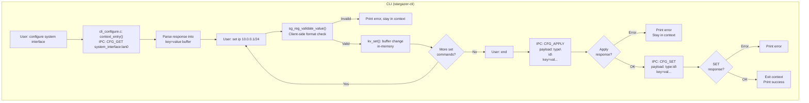

---

## 3. Config Change Flow (Web UI)

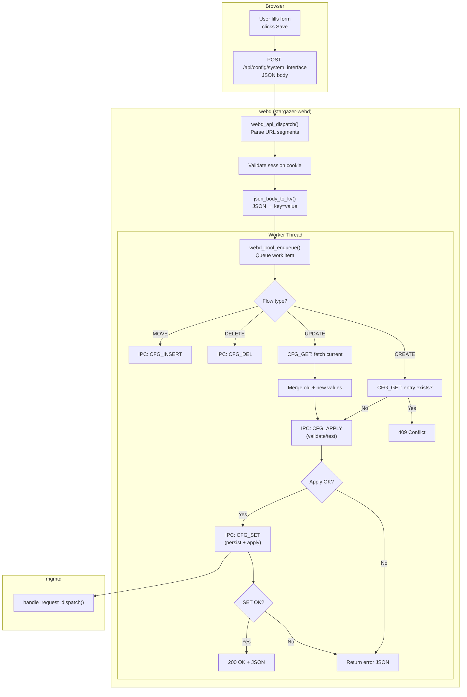

---

## 4. mgmtd CFG_SET Handler (Central)

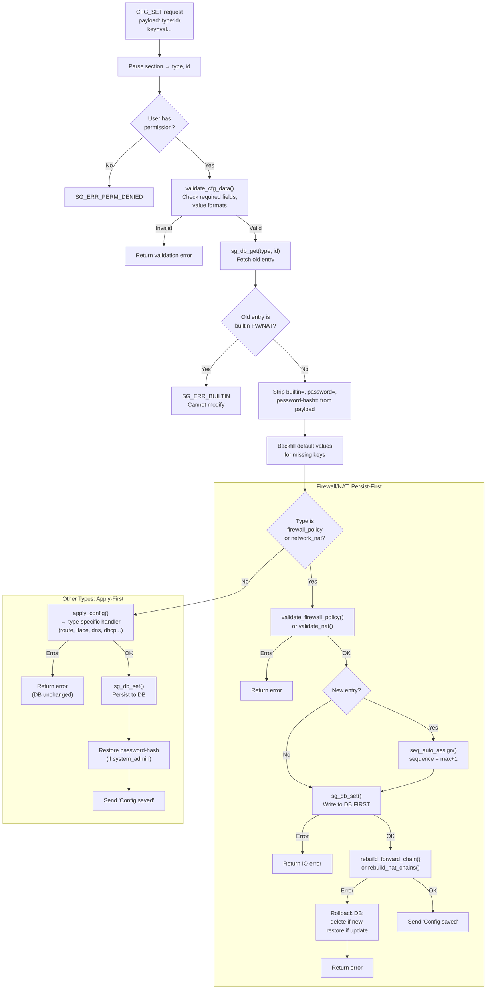

---

## 5. CFG_DEL Handler

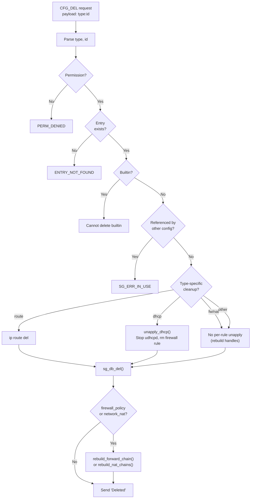

---

## 6. Packet Processing Flow

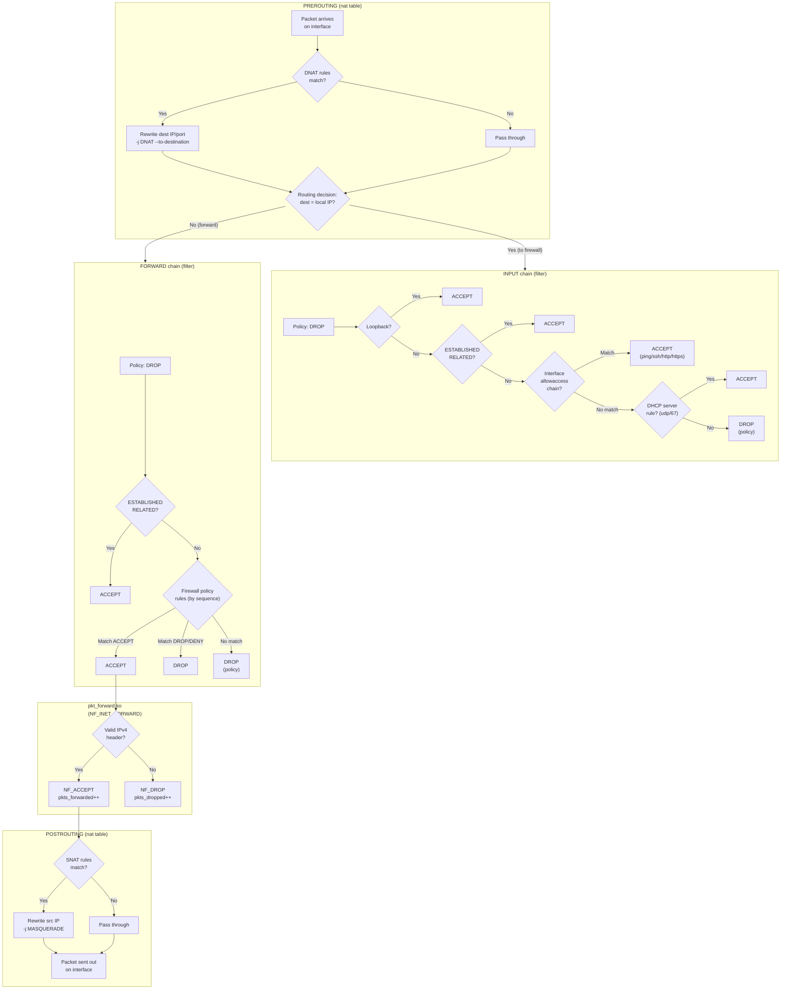

---

## 7. Firewall Policy Rebuild Flow

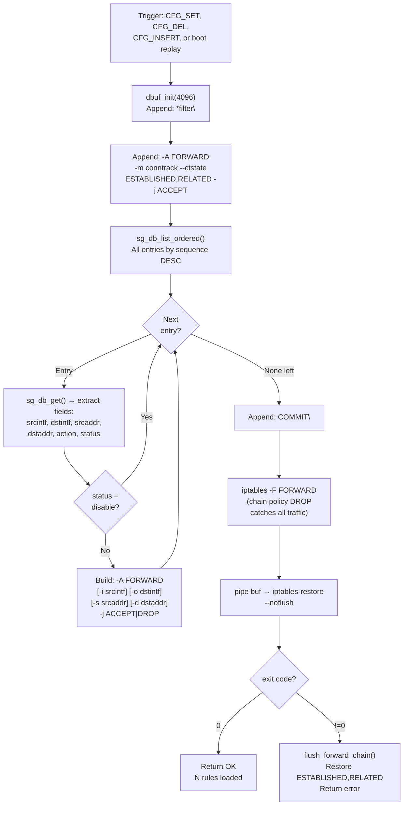

---

## 8. NAT Rebuild Flow

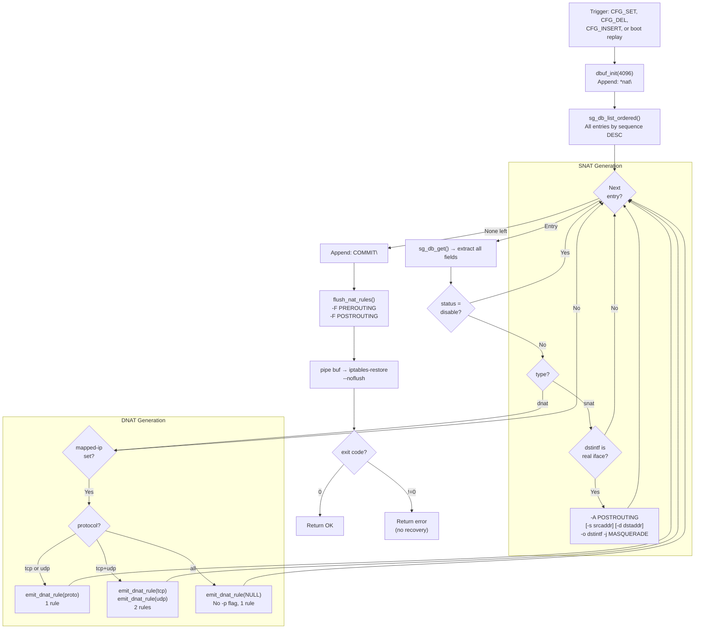

---

## 9. Login & Authentication Flow

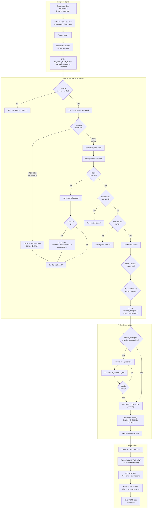

---

## 10. DHCP Server Lifecycle

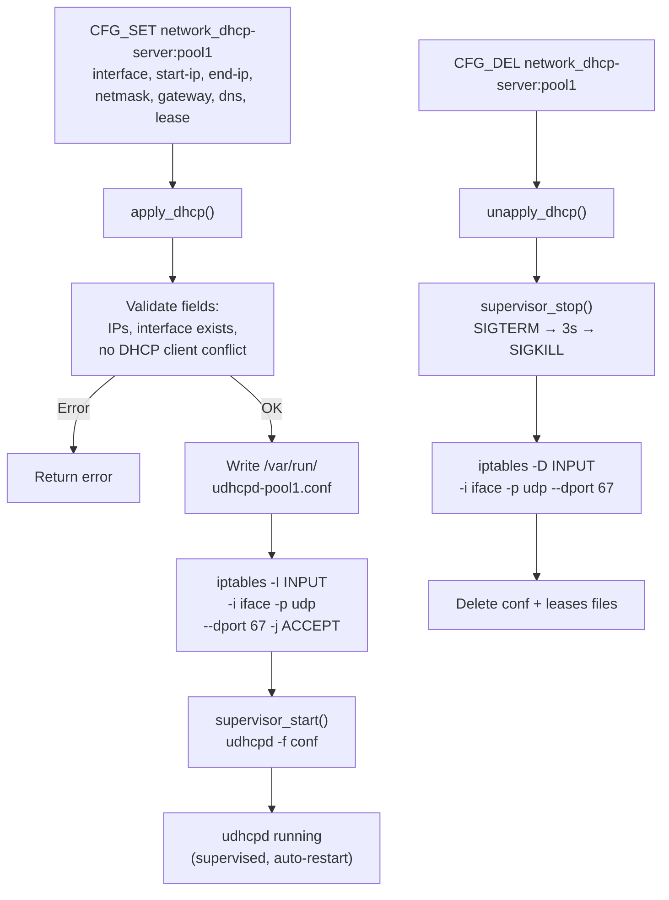

---

## 11. Interface Apply Flow

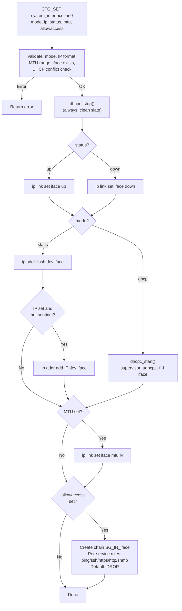

---

## 12. Codebase Review — Issues & Recommendations

### Critical (Fix before release)

| # | Issue | File:Line | Description |
|---|-------|-----------|-------------|
| 1 | DHCP race condition | `mgmtd_apply_iface.c:288` + `mgmtd_apply_dhcp.c:299` | `dhcpc_stop()` is async — if interface transitions DHCP server → client, udhcpd may still hold the port |
| 2 | Allowaccess chain leak | `mgmtd_apply_iface.c:60-150` | `SG_IN_<iface>` chain created but never deleted with `iptables -X` on CFG_DEL |
| 3 | DHCP FW rule orphan on crash | `mgmtd_apply_dhcp.c:145-147` | If udhcpd crashes and conf file is missing, `iptables -D INPUT -p udp --dport 67` never runs |

### High

| # | Issue | File:Line | Description |
|---|-------|-----------|-------------|
| 4 | Route gateway not validated | `mgmtd_apply_route.c:54-62` | `ip route replace` succeeds even if gateway is unreachable |
| 5 | webd trusted for all users | `stargazer-mgmtd.c:4878` | Compromised webd can inject any username in IPC requests |
| 6 | Chain name truncation | `mgmtd_apply_iface.c:65` | `SG_IN_<iface>` can exceed 31-char iptables limit |

### Medium

| # | Issue | File:Line | Description |
|---|-------|-----------|-------------|
| 7 | No CSRF tokens on POST | `webd_api.c:43` | SameSite=Strict not set on all responses |
| 8 | getrandom() unchecked | `webd_session.c:35` | Return -1 → uninitialized token |
| 9 | query_param unbounded malloc | `webd_api.c:138` | DoS via large query params |
| 10 | Supervisor restart race | `stargazer-mgmtd.c:895` | DB condition can change between SIGCHLD reap and restart check |
| 11 | Config rollback not implemented | `stargazer_ipc.h:500` | COMMIT/REVISIONS/ROLLBACK are stubs |
| 12 | extract_val truncation silent | `stargazer-mgmtd.c:2454` | Truncated values used without error |
| 13 | flush_* uses fprintf not mgmt_log | `stargazer-mgmtd.c:392,403,415` | Inconsistent logging |
| 14 | DEBUG_STATE_FILE in /tmp | `stargazer-mgmtd.c:67` | World-writable path for debug flags |

### Medium (cont.)

| # | Issue | File:Line | Description |
|---|-------|-----------|-------------|
| 15 | Server-side ref existence check missing | `stargazer-mgmtd.c` CFG_SET | `ref-or:` and `ref-iface:` fields only validate **format** server-side, not that the referenced object exists in DB. CLI checks via IPC (`cli_configure.c:617`), but Web API / raw IPC can create entries referencing nonexistent objects (e.g. `srcaddr=nonexistent_address`) |
| 16 | NAT srcaddr/dstaddr not using address objects | `sg_validate.c:66-67` | NAT uses `cidr-or:any,all` (raw CIDR) while firewall_policy uses `ref-or:firewall_address` (address objects). Inconsistent — cannot reuse address objects in NAT rules |

### Low (v2.0 / document)

| # | Issue | Description |
|---|-------|-------------|
| 17 | No IPv6 support | IPv4 only throughout |
| 18 | No VLAN/PPPoE/Tunnel | Physical interfaces only |
| 19 | No QoS/traffic shaping | No bandwidth/priority rules |
| 20 | Password change doesn't invalidate sessions | Old tokens remain valid |
| 21 | Unused IPC commands | OSPF/RIP/BGP enums defined but not implemented |
| 22 | session.c not wired into pkt_forward.ko | Session tracking infrastructure exists but unused |

### Recommended Priority for Next Sprint

1. Fix #1 (DHCP race) + #3 (DHCP FW orphan) — reliability
2. Fix #2 (chain leak on delete) — resource leak
3. Fix #15 (server-side ref existence check) — data integrity
4. Fix #7 (CSRF) + #8 (getrandom) — web security
5. Implement #11 (config rollback) — operational safety
6. Wire session.c into pkt_forward.ko (#22) — data plane advancement
