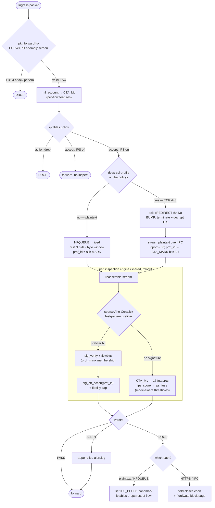

# Stargazer NGFW — IPS / SSL / ML Inspection Pipeline

How the data plane (`pkt_forward.ko` + `nf_conntrack`), the IPS daemon
(`stargazer-ipsd`), the TLS MITM proxy (`stargazer-ssld`) and the LightGBM
machine-learning model fit together to inspect traffic and act on it.

---

## 1. Big picture

```
                         ┌──────────────────────── stargazer-mgmtd (root) ────────────────────────┐
                         │  compiles policy → iptables, profile maps (<id>.rules), connmark stamp  │
                         └──────────┬───────────────────────────┬──────────────────────┬──────────┘
                                    │ (control)                 │                      │
            ┌───────────────────────▼──────┐        ┌───────────▼─────────┐   ┌────────▼─────────┐
 packet ─►  │ KERNEL data plane            │        │ stargazer-ipsd      │   │ stargazer-ssld   │
            │  - pkt_forward.ko (FORWARD)  │        │ (NFQUEUE + IPC srv) │   │ (TLS MITM proxy) │
            │  - nf_conntrack + CTA_ML     │        │  - signature engine │◄──┤  decrypt HTTPS   │
            │  - connmark (policy/prof/IPS)│        │  - ML scoring       │IPC│  → plaintext     │
            └───────────────┬──────────────┘        └─────────┬───────────┘   └──────────────────┘
                            │ NFQUEUE (plaintext / first N pkts or byte window)
                            └──────────────────────────────────┘
```

**Two inspection paths, one engine:**

| Path | Trigger | How payload reaches ipsd | prof_id source |
|---|---|---|---|
| **Plaintext** (HTTP, any TCP/UDP) | per-policy NFQUEUE rule | kernel queues packets to ipsd | skb **MARK** (low/profid bits) |
| **Decrypted HTTPS** | policy has deep `ssl-profile` | ssld decrypts → streams plaintext over a Unix socket (IPC) to ipsd | conntrack **CTA_MARK** (bits 3-7) |

Both paths run the **same** signature engine and the **same** ML model inside
ipsd, and resolve the **same** per-(profile, sid) action.

### 1.1 End-to-end workflow



---

## 2. Kernel data plane

### 2.1 `pkt_forward.ko` (Netfilter `NF_INET_FORWARD`)
- Stateless **anomaly screen**: validates IPv4, drops L3/L4 attack patterns
  (Land, source routing, NULL/XMAS/FIN scans, SYN-with-data, Ping of Death).
- **Feature tap**: accounts per-flow ML features into the conntrack `NF_CT_EXT_ML`
  extension (`ml_account()`) — sums / sums-of-squares, no floats in kernel.
- Holds no per-session state, enforces no blocks. SMP-safe atomic counters.

### 2.2 `nf_conntrack` + `CTA_ML`
- Single source of truth for flows. The Stargazer kernel patch adds
  `struct nf_conn_ml` (`NF_CT_EXT_ML`), allocated on every flow, exported as a
  binary attribute **`CTA_ML`** (=27) on the ctnetlink dump path.
- Userspace mirrors it as `struct sg_nf_conn_ml` (144 bytes, `_Static_assert`) —
  must stay byte-for-byte identical to the kernel struct.

### 2.3 connmark layout (32-bit)
```
 bit 0      DIRTY        (mgmtd dirty-session re-eval)
 bit 1      IPS_BLOCK    flow convicted by ipsd → every packet dropped
 bit 2      IPS_INSPECTED verdict reached → offload, out of the queue
 bits 3-7   IPS_PROFID   IPS profile id 1..31  (SG_CMK_IPS_PROFID_MASK 0xF8)
 bits 8-31  policy_id    cmkid of the permitting policy
```
- mgmtd stamps `policy_id` (ACCEPT rule) and `IPS_PROFID` (per the policy's
  IPS profile). ipsd sets `IPS_BLOCK` / `IPS_INSPECTED` via the NFQUEUE verdict.

---

## 3. ipsd — signature engine

### 3.1 Sparse Aho-Corasick (CSR)
- One trie of all rules' fast-patterns (longest, most-selective content per rule).
- **Sparse CSR** storage: each node keeps only existing edges in one flat
  `edges[]` array (sorted by byte, binary-search lookup) + a fail link →
  ~tens of bytes/node instead of ~1 KB for a dense 256-way DFA. The all-rules
  automaton fits in a few MB. Search is amortized-linear.
- Build: `ac_add_pattern` (trie) → `ac_build` (BFS fail/out links, then FREEZE
  scratch edge-lists into the CSR array). Frozen → lock-free concurrent reads.

### 3.2 Shared rule table + per-profile maps (RAM)
- **One** automaton + **one** rule table for ALL profiles (max 31).
- Each rule carries two 32-bit masks:
  - `prof_mask` — which profiles include the rule (bit i = profile id i+1).
  - `prof_drop_mask` — which profiles want it to DROP (else ALERT).
- A profile is a **bit overlay**, not a copy: `sig_load_profile_maps()` reads
  `<profid>.rules` (lines `<sid> block|alert`) and sets the bits — no rebuild.
  Adding a profile costs 1 bit/rule, not a duplicated ruleset.
- Effective action per flow: `sig_eff_action(rule, prof_id)`
  - `prof_id == 0` → rule's **base action** (legacy / unscoped match-all).
  - `prof_id 1..31` → DROP if `prof_drop_mask` bit set, else ALERT.
  - Non-members never match (membership enforced in `sig_verify`).

### 3.3 Fidelity cap
- Rules using unsupported keywords (pcre cap, complex byte_test/jump, unknown
  narrowing keyword, dangling flowbits) are clamped to `SIG_FID_ALERT` →
  capped to ALERT even if the profile says block (avoids false drops).
- `execute diagnose ips status` reports `loaded_full` (may DROP) vs
  `loaded_alert` (clamped). All loaded rules are resident in RAM.

### 3.4 Default loading
- mgmtd compiles `active.rules` from the **whole repo** (`ips_compile_categories
  ".../repo", "all", ...`). ipsd loads the entire file eagerly at startup into
  the shared table + builds one automaton (no lazy loading). Profiles only
  *select* among the loaded rules via the masks.

---

## 4. ipsd — machine-learning scoring

### 4.1 The 17 features (`feature.h` / `feature.c`, `feature_order.json`)
Computed by `feature_extract()` from `CTA_ML` + ACCT counters + the SYN window:

```
 0  Flow IAT Std           7  Bwd Packet Length Mean    14 Total Length Fwd Packets
 1  Flow IAT Min           8  SYN Flag Count            15 Total Length Bwd Packets
 2  Flow IAT Mean          9  ACK Flag Count            16 Flow Duration (µs)
 3  Fwd IAT Std           10  PSH Flag Count
 4  Packet Length Var     11  URG Flag Count
 5  Packet Length Std     12  Down/Up Ratio
 6  Fwd Packet Length Mean 13 Init_Win_bytes_forward
```
- Variance/std use the **sample** form; Down/Up is **integer** divide; flag
  counts kept **raw**; init-win = −1 when unknown. Formulas mirror the host
  feature extractor so **train == serve**.
- Features 14-16 (volume + duration) target the Infiltration download stage.

### 4.2 Scoring & fusion
- `ips_score(feat)` → `predict()` (tl2cgen-generated C, sigmoid applied) →
  probability in [0,1].
- `ips_fuse(cfg, …, score)` turns the score into a verdict using the thresholds
  (`thr_block` 0.95 → DROP, `thr_alert` 0.50 → ALERT) and downgrades DROP→ALERT
  when the global IPS **mode = detect**.
- The ML checkpoint fires once a flow has enough data (≥ `INSP_ML_PKTS` packets
  or `INSP_ML_BYTES` bytes), only when signatures did not already match.

---

## 5. stargazer-ssld — TLS MITM

### 5.1 Steering
- mgmtd emits **per-policy** `nat PREROUTING -i <srcintf> -p tcp --dport 443
  -j REDIRECT --to-ports 8443+i` for each accept policy whose `ssl-profile` is
  deep **and** has IPS on. Each ssld instance serves one ssl-profile (port
  `BASE+i`). IPv4 only — IPv6 is not steered.

### 5.2 Per connection (`ssld_handle_conn`)
1. `SO_ORIGINAL_DST` → real server; PEEK ClientHello (SNI).
2. `tls_policy_decide` → **BUMP** (terminate+decrypt+inspect, re-sign cert with
   the firewall CA) or **SPLICE** (no decrypt, raw relay).
3. On BUMP: `pump_ssl` reads plaintext each direction → inspects.
   - **IPC mode** (default, `ipc-inspect=enable`): ssld forwards plaintext over
     a Unix socket to ipsd's IPC server (ipsd does the inspection with its full
     stateful engine — ssld carries no rules).
   - **Per-chunk mode** (`-Q`): ssld inspects locally against its own ruleset.
4. On a DROP verdict ssld writes the FortiGate-style block page to the client —
   **only if no response byte has reached the client yet** (otherwise appending
   an HTTP 403 would render as garbage; it just closes the connection instead).

### 5.3 dport normalization
- After TLS decryption the payload is HTTP at L7. ipsd sets `fc.dport = 80` for
  the IPC flow so ET signatures scoped to `$HTTP_PORTS` match (port 443 would
  miss every HTTP rule). The real server port stays in `o->srv_port`.

---

## 6. The IPC path (ssld ↔ ipsd) — `insp_ipc.c`

- Protocol: `INSP_OPEN` (srv_ip/port, SNI, leg tuple, profile_id) →
  `INSP_DATA` chunks (plaintext, direction) → ipsd replies `INSP_VERDICT`
  (PASS / ALERT / DROP, sid, msg, score). One handler thread per ssld
  connection, each owning a virtual flow (reassembly + flowbits).
- Inspection reuses the shared ruleset under `rdlock` (safe with NFQUEUE).
- **prof_id recovery (the key to per-profile block on HTTPS):** ssld cannot tag
  the flow, so it sends `profile_id = 0`. ipsd recovers the real id from the
  redirected flow's conntrack entry via `ctdump_query` of **CTA_MARK**, keyed by
  the **ORIGINAL tuple `(client → server:443)`** — *not* `(client → fw:8443)`,
  which matches no conntrack tuple. It extracts bits 3-7 →
  `fc.prof_id = 1..31`. Failure → keeps 0 (fail-safe = inspect every rule).
- ML on HTTPS: when no signature matched, ipsd reads the same flow's `CTA_ML`
  (same original tuple), runs `ips_score` + `ips_fuse`. Requires `ml-https`
  enabled (the kernel `ml_account_local` LOCAL_IN hook).

---

## 7. Action resolution & block enforcement

| | Plaintext / NFQUEUE | Decrypted HTTPS / IPC |
|---|---|---|
| prof_id | skb MARK (set in FORWARD before NFQUEUE) | CTA_MARK bits 3-7 (read by ctdump) |
| signature action | `sig_eff_action(rule, prof_id)` + fidelity cap | same |
| ML | score → `ips_fuse` (mode-aware) | same |
| **block** | NFQUEUE verdict DROP + set `IPS_BLOCK` connmark (iptables `-m connmark --mark 0x2/0x2 -j DROP` drops the rest of the flow) | ipsd returns `INSP_DROP` → ssld closes the connection + block page |
| alert | append to `ips-alert.log` | same |

> A per-profile `set action block` only DROPs when prof_id ∈ 1..31 reaches the
> engine. If prof_id resolves to 0 (e.g. ctdump miss), the rule falls back to its
> **base action** — and most ET rules ship as `alert`, so it only alerts.

---

## 8. ML training pipeline (offline, host)

```
 CICIDS2017 pcaps ─► pcap_feat (host) ─► CSV (17 features) ─► label by IP+time-window
        │              mirrors kernel ml_account + feature_extract                │
        │                                                                         ▼
        │                                          LightGBM train (class weights) 
        ▼                                                       │
 device feature_extract  ◄── parity (≈1e-7) ──  treelite/tl2cgen ─► model/predict.c
```
- **Train == serve:** `pcap_feat` links the *same* `feature.c` + `ips_model.c` +
  `predict.c` as the firmware, so the CSV features equal what the device computes
  at runtime (fixes the original CICFlowMeter train/serve skew).
- Labels: official CICIDS2017 IP + time-window schedule (ADT = UTC−3); post-NAT
  in-pcap addresses (external attacker → `172.16.0.1`, web victim →
  `192.168.10.50`).
- Class weighting lifts minority/hard classes (SSH/web brute-force, Infiltration
  download).
- Export: LightGBM → `treelite.load_lightgbm_model` → `tl2cgen.generate_c_code`
  → `header.h`/`main.c` integrated as `model/predict.h`/`predict.c`
  (sigmoid baked in). Verified by a Python-vs-C parity check (~1e-7).
- Re-test with the host tool: `pcap_feat -c <pcap>` (CSV with `score`) or
  `pcap_feat <pcap>` (per-flow `ips_score => DROP/ALERT/PASS`); `score_stdin`
  scores a single 17-feature vector.

---

## 9. Configuration & diagnostics (CLI)

```
config security ips                 # global switch: set status enable, mode detect|prevent
config security ips-profile         # numeric profiles 1..31; nested:
    edit 2
        config filter               # FortiOS-style nested sub-table
            edit 1
                set rule 2100498     # or: set category <repo-file-name>
                set action block
config firewall policy
    edit 2
        set ips-profile 2           # attach a profile to a policy
        set ssl-profile 1           # deep SSL inspection (for HTTPS)

execute diagnose ips status         # daemon state, loaded/loaded_full/loaded_alert, counters
execute diagnose ips alerts         # recent DROP/ALERT log (NO ALERTS when empty)
execute diagnose ips scores         # per-flow ML scores
execute diagnose ssl                # ssld state, CA, steering rule
execute diagnose firewall conntrack # connections + connmark (decode bits 3-7 = profid)
```

**Gotchas observed:**
- Global `security ips status=disable` → ipsd does not run (only profile/policy
  enabled is not enough).
- IPv6 bypasses inspection (steering + NFQUEUE are IPv4) — force IPv4 to test.
- HTTPS needs a deep `ssl-profile` on the policy and the firewall CA trusted on
  the client, or it stays encrypted/spliced and signatures cannot match.
- Per-profile `block` needs prof_id to reach the engine; verify via the connmark
  (`mark` bits 3-7) on `execute diagnose firewall conntrack`.
